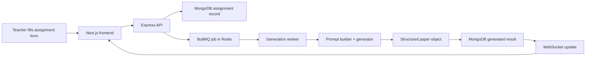

# VedaAI Exam Builder

VedaAI Exam Builder is a full-stack assessment creation app built for the VedaAI hiring assignment. I kept the product close to the provided Figma flow: a teacher creates an assignment blueprint, the backend queues the generation work, and the final paper is shown in a clean exam-paper layout with PDF export.

The main idea was to avoid rendering raw AI text. The backend turns the teacher's inputs into a structured prompt, normalizes the generated result into sections/questions/marks/difficulty, stores it, and then notifies the frontend through WebSockets.

## Live Demo

Frontend Deployment (Vercel): https://web-two-kappa-68hp1z8c9i.vercel.app

Note: The deployed version currently hosts the frontend interface.
The complete backend workflow (Express API, BullMQ workers, Redis queue, WebSocket updates, and MongoDB integration) is fully available in the repository and supported in local setup.

## What Works

- Assignment creation form with validation for required fields and positive marks/counts
- Question type configuration with totals for questions and marks
- Optional file/text material input
- MongoDB persistence for assignments and generated papers
- Redis + BullMQ background generation queue
- WebSocket updates for queued/generating/completed states
- Structured paper preview with student details, sections, difficulty labels, marks, and answer key
- PDF download from the generated paper view
- Mock generator fallback when no `OPENAI_API_KEY` is provided

## Tech Stack

**Frontend**

- Next.js App Router
- TypeScript
- Redux Toolkit
- Plain CSS/global styling
- jsPDF

**Backend**

- Node.js + Express
- TypeScript
- MongoDB + Mongoose
- Redis + BullMQ
- WebSocket server
- Zod validation
- OpenAI SDK with local mock fallback

## Architecture



## Project Flow

1. The teacher enters assignment details, question types, marks, and instructions.
2. The frontend validates the form and sends the assignment to the API.
3. The API validates again with Zod and stores the assignment as `queued`.
4. A BullMQ job is added to Redis.
5. The worker builds a structured prompt and generates a paper.
6. The paper is saved as a structured object, not raw model text.
7. The WebSocket layer sends progress/completion updates to the frontend.
8. The teacher views the paper and can download it as a PDF.

## Folder Structure

```text
apps/
  web/
    src/app/              Next.js routes and global styles
    src/components/       UI components for the dashboard and paper view
    src/lib/              API helpers, types, and PDF export
    src/store/            Redux Toolkit setup

  api/
    src/config/           Environment, MongoDB, and Redis config
    src/models/           Mongoose assignment model
    src/queues/           BullMQ queue setup
    src/routes/           Express routes
    src/services/         Prompt building, validation, generation logic
    src/sockets/          WebSocket broadcast helper
    src/workers/          Background generation worker
```

## Key Files

- `apps/web/src/components/AssignmentForm.tsx` - assignment creation form and validation
- `apps/web/src/components/PaperPreview.tsx` - live status, paper preview, regenerate, PDF export
- `apps/web/src/store/assignmentsSlice.ts` - Redux state for assignments
- `apps/api/src/routes/assignments.ts` - REST endpoints and queue enqueueing
- `apps/api/src/workers/generation.worker.ts` - BullMQ worker
- `apps/api/src/services/promptBuilder.ts` - converts teacher input into a structured prompt
- `apps/api/src/services/questionGenerator.ts` - OpenAI generation plus local mock fallback
- `apps/api/src/sockets/hub.ts` - assignment-specific WebSocket updates

## Local Setup

```bash
git clone https://github.com/aditiiisinghh/VedaAI-Exam-Builder.git
cd VedaAI-Exam-Builder
npm install
```

Create a `.env` file in the root:

```env
MONGODB_URI=mongodb://127.0.0.1:27017/vedaai-assessment
REDIS_URL=redis://127.0.0.1:6379
OPENAI_API_KEY=
PORT=4000
NEXT_PUBLIC_API_URL=http://localhost:4000
NEXT_PUBLIC_WS_URL=ws://localhost:4000
```

Start MongoDB and Redis:

```bash
docker compose up -d
```

Run both apps:

```bash
npm run dev
```

Frontend runs on `http://localhost:3000` and backend runs on `http://localhost:4000`.

## Notes on AI Generation

The app is designed so the UI never depends on raw LLM text. The generator returns a structured paper object with:

- sections
- questions
- difficulty
- marks
- answer key

If `OPENAI_API_KEY` is missing, the backend uses a mock generator. This makes local review easier without blocking the whole workflow.

## Verification

```bash
npm run typecheck
npm run build
```

Both commands should pass before submission.

## Deployment Plan

Recommended setup:

- Frontend: Vercel
- Backend: Render, Railway, or Fly.io
- Database: MongoDB Atlas
- Redis: Upstash or Redis Cloud

For deployment, set:

- `NEXT_PUBLIC_API_URL`
- `NEXT_PUBLIC_WS_URL`
- `MONGODB_URI`
- `REDIS_URL`
- `OPENAI_API_KEY`

## Future Improvements

- Teacher login and saved classes
- Better generated-output schema validation
- Saved question-paper templates
- PDF storage in cloud storage
- Analytics for generated assignments
- Role-based dashboard for multiple teachers

## Author

- GitHub: [aditiiisinghh](https://github.com/aditiiisinghh)
- LinkedIn: [Aditi Singh](https://www.linkedin.com/in/aditi-singh-59a7872b0)
