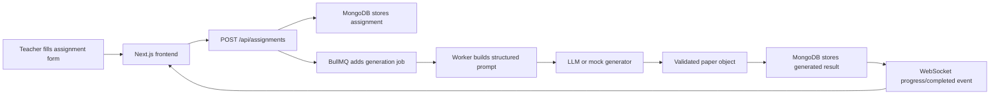

# VedaAI Assessment Creator

A full-stack AI assessment creator for teachers. The app lets a teacher create an assignment blueprint, queues AI question-paper generation in the backend, stores the result, and streams real-time progress back to the UI.

## What Is Built

- Next.js + TypeScript frontend inspired by the provided VedaAI Figma screens.
- Redux Toolkit for assignment and generation state.
- Express + TypeScript API.
- MongoDB for assignments and generated papers.
- Redis + BullMQ for background generation jobs.
- WebSocket updates for live generation status.
- Structured AI output parsing instead of rendering raw LLM text.
- PDF download for the generated question paper.
- Mock generation fallback when `OPENAI_API_KEY` is not present, so the project can still be reviewed locally.

## Architecture



## Local Setup

```bash
npm install
cp .env.example .env
docker compose up -d
npm run dev
```

Frontend: `http://localhost:3000`  
Backend: `http://localhost:4000`

If you do not add an `OPENAI_API_KEY`, the backend uses a deterministic mock generator. That is intentional for easy local review.

## Environment Variables

```bash
MONGODB_URI=mongodb://127.0.0.1:27017/vedaai-assessment
REDIS_URL=redis://127.0.0.1:6379
OPENAI_API_KEY=
PORT=4000
NEXT_PUBLIC_API_URL=http://localhost:4000
NEXT_PUBLIC_WS_URL=ws://localhost:4000
```

## Important Files

- `apps/web/src/components/AssignmentForm.tsx` - form validation, file upload, question blueprint.
- `apps/web/src/components/PaperPreview.tsx` - WebSocket status handling, structured paper view, PDF export.
- `apps/web/src/store/assignmentsSlice.ts` - Redux state for assignments.
- `apps/api/src/routes/assignments.ts` - API endpoints and job enqueueing.
- `apps/api/src/workers/generation.worker.ts` - BullMQ worker that generates and stores papers.
- `apps/api/src/services/promptBuilder.ts` - converts teacher input into a structured AI prompt.
- `apps/api/src/services/questionGenerator.ts` - LLM call plus safe mock fallback.
- `apps/api/src/sockets/hub.ts` - assignment-specific WebSocket broadcast.

## Interview Walkthrough

The project follows the requested flow:

1. The teacher creates an assignment from the frontend.
2. The frontend validates required fields and positive marks/counts.
3. The backend validates again with Zod.
4. The assignment is stored in MongoDB with `queued` status.
5. A BullMQ job is added to Redis.
6. The worker picks the job, builds a structured prompt, calls the generator, and normalizes the result into sections/questions.
7. The generated paper is saved back to MongoDB.
8. The WebSocket layer notifies the selected frontend client.
9. The UI renders a real exam-paper layout instead of raw model text.

## Deployment Notes

Suggested deployment:

- Frontend: Vercel.
- Backend: Render/Railway/Fly.io.
- MongoDB: MongoDB Atlas.
- Redis: Upstash or Redis Cloud.

Set `NEXT_PUBLIC_API_URL` and `NEXT_PUBLIC_WS_URL` on the frontend deployment to point to the hosted backend. Set `MONGODB_URI`, `REDIS_URL`, and `OPENAI_API_KEY` on the backend host.

## Checks

```bash
npm run typecheck
npm run build
```

## Design Notes

The UI intentionally keeps the core Figma structure: left rail navigation, assignment cards, creation form, and a formal paper preview. Added details include generation progress, status badges, regenerate action, and difficulty tags so the assignment feels complete rather than just copied from a static mockup.
